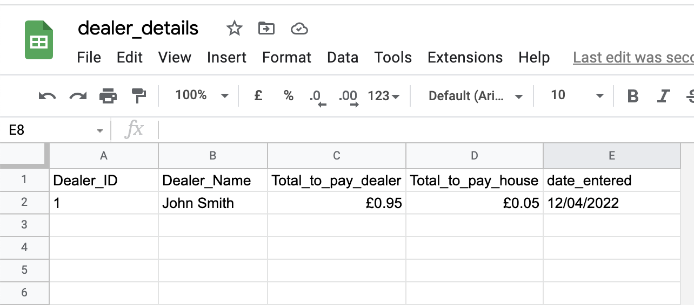
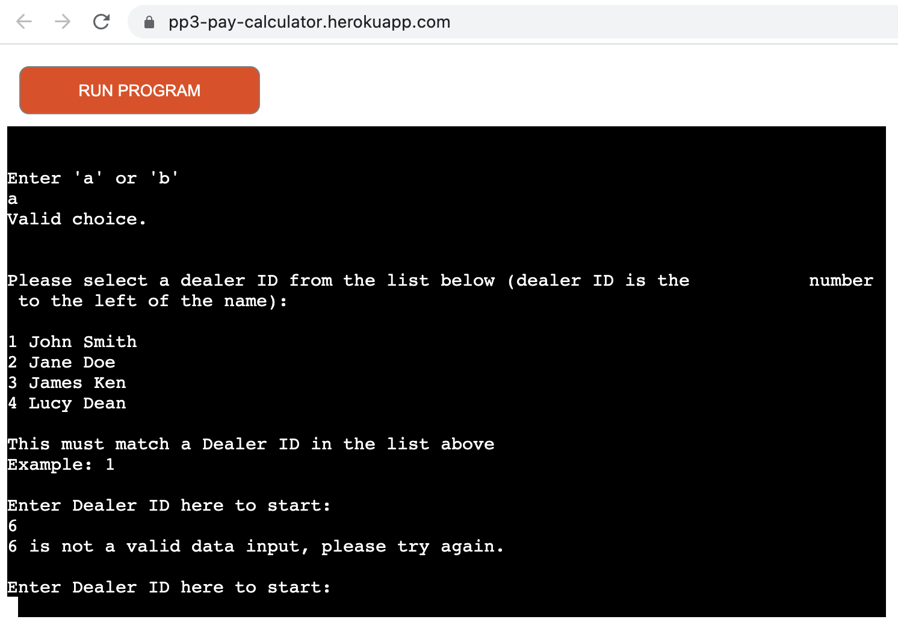
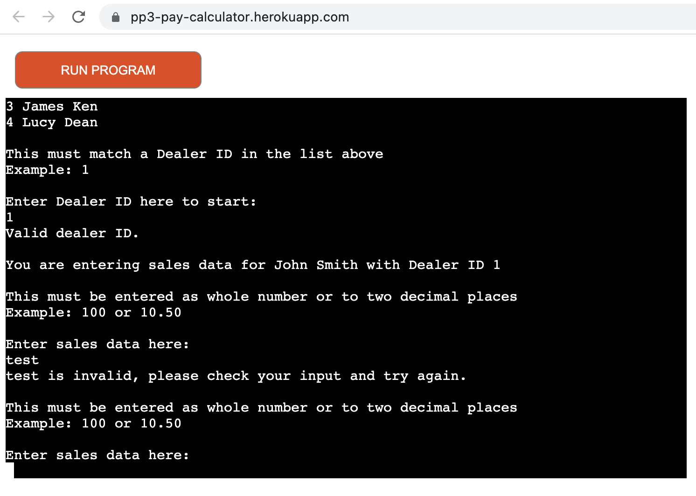
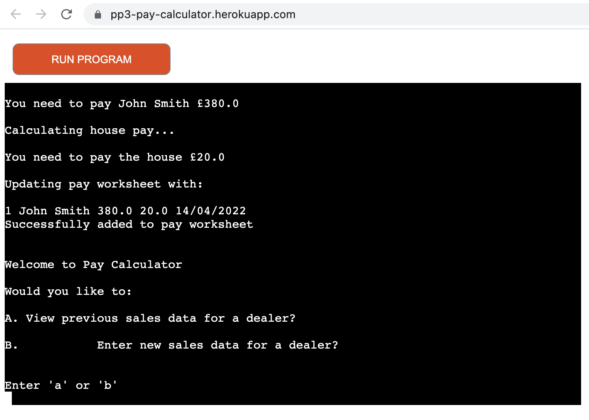

# PP3 - Pay Calculator

Pay Calculator is tool created for an imagined real-world scenario where an owner of a large barn rents space to various dealers. The owner of this land takes a 5% commission from all sales made by the dealers. The problem for the owner is they do not have a central till or payment system yet. So the sales for each dealer come in many different ways such as: scraps of paper or by text, etc. The owner has requested a simple command line programme that will allow them to quickly input sales data for each dealer, and then calculate how much the dealer should be paid and how much should go to the owner of the land.

Pay Calculator achieves the project goal by requesting the data in a command interface on a platform called Heroku, validates the data, calculates the pay for the dealer and the owner, displays it in real-time to the command interface and also then stores it in a Google Sheet for the owner to access historical inputs.

[The live project can be viewed here.](https://pp3-pay-calculator.herokuapp.com/)

# Planning

I started out by planning the requirements for the Pay Calculator in a flow diagram using [Lucid Charts](https://www.lucidchart.com/pages/). This allowed me to fully scope what I needed the tool to do and was useful to refer back to, to ensure I was staying on track with the intended outputs for the project.

Please see my original plan below:

I largely stuck to the plan except I decided to update the worksheet all in one API call as the final task, rather than on two separate calls to updated sales first and then the pay calculations later. I read that it is best served to have as few API calls as possible in an application to keep loading/run-time as quick as possible.

# How to use Pay Calculator

There are currently 4 imaginary dealers in the Google Sheet used for this project. You will need a Dealer_ID from the picture below to make the tool work.

1. Enter your Dealer_ID into the command line prompt, taking note of type of data the tool will accept.
2. Enter the sales total for that dealer into the command line, again taking note of the type of data the tool will accept.
3. Press 'Run Programme' to restart the tool

The outcome of a successful use of the tool will be the command interface showing the total to pay to the dealer and the total to pay to the house (owner). The command line interface will also confirm data has been added to the Google worksheet.

# Features

## Existing Features

### Google Sheets

The data for this programme is stored in dealer_details Google sheet. This can be accessed as read-only [here](https://docs.google.com/spreadsheets/d/1ce3DIRFEajKR9P0evQ10GI1JoCKMAHC_XtExZa5ZjZQ/edit?usp=sharing). There are two tabs, 'dealer' which stores the Dealer_ID and corresponding Dealer_Name which is used in the programme to give a name to an ID for the user. This is so the user has a way to double check they are inputting data for the right person. I chose to do this with an integer ID over just using the name of the dealer as there are better data validation controls with integers. I felt there were too many risks to trying to validate a string. To make this work work I had to import gspread library and Google auth which allowed me to interact directly with Google Sheets.

Then there is the 'pay' tab which stores all the outputs from the calculator: 'Dealer_ID', 'Dealer_Name', 'Total_to_pay_dealer' and 'Total_to_pay_house'. This information is also displayed in the terminal but it's useful to store this history for the user to refer back to.

]

## Command Line Programme 

### Welcome Message and User Input for Dealer ID

When the programme runs in Heroku a welcome message, notes on what kind of data to enter and empty input ready to take Dealer ID are the first thing the user sees.

### Data Validation on Dealer ID User Input

Once the user enters a value into the command line there is some data validation to check that the input is an integer and that it matches a Dealer ID in the dealer worksheet.

If the data is invalid then an error message is printed to the terminal either for invalid integer or incorrect Dealer ID. For example, here is the error message that appears for incorrect Dealer ID:

As you can see the function to request a Dealer ID has re-appeared below the error message. This is setup up to keep running until there is a correct input from the user.

### User Input for Sales Data

Once a correct dealer ID is entered the Dealer ID function stops running; tells the user it's a valid ID; pulls in the name of dealer from the dealer_details dealer worksheet in the Google sheet and instead requests sales data input from the user.

### Sales Data Validation

Once the user enters sales data into the input it validates whether the value entered is an integer or a float. If either of these validations are incorrect an error message is printed to the terminal and as with the Dealer ID input the sales data input function will continue to run until it passes validation. For example if the user enters text value by mistake:

### Calculating Dealer Pay, House Pay and Updating Worksheet

Once the user enters correct sales data the Sales Data Input stops running and the programme uses the user input to: 

* confirm sales data is valid
* calculate how much to pay the dealer
* print the amount to pay the dealer to the terminal
* calculate how much to pay the house
* print the amount to pay the house to the terminal
* print a list, comma separated, for what is being updated in the dealer_details pay worksheet
* update the worksheet
* print a confirmation of what data was added to the spreadsheet
* the function ends here

## Future Features

* The ability to access a menu and choose to pull existing data or run the Pay Calculator
* The ability to delete data from the pay worksheet
* Add sales period to the pay worksheet to give more meaning to data inputted
* The ability to enter more than one user ID and sales data at a time

# Data Models
I decided to use Google Sheets as my data model rather than storing data in data model classes. I felt this was more realistic for my imagined purpose as the imagined user is not a programmer. There is possibility with future development that I could take data from the Google Sheet and store that in classes. I would use this especially to be able to develop the functionality for multiple Dealer ID's and sales inputs.

I have used other objects as temporary data storage such as a dictionary to store the dealer name in a function. This dictionary is then used in the function to access dealer names across multiple functions.

# Testing

I have manually tested Pay Calculator in the following ways:

* Pass the code through PEP8 linter and confirmed there are no errors
* Inputted different types of incorrect data into the input fields, i.e. special characters, strings where there should have been integers, etc. And have confirmed no unexpected error messages.
* Tested the programme in both my GitPod terminal and Code Institute instance of Heroku and the programme runs exactly as expected.

## Bugs

Solved bugs:

* Float error 1:

In my original function for getting sales data, I hadn't accounted for float values as sales - sales may not always be a integer. I was receiving errors such as:

To fix the issue I created a function to check and pass the value if it was a float or an integer and pass an error if it is not:

* Float error 2

Once I allowed floats to be passed into the programme, I then had to account for them in the functions that calculate dealer and house pay. I did this by getting the function to run a different sum based on int() and float() methods depending on which value was passed. For example in calculating dealer pay, I used the following:

## Remaining Bugs

* No known bugs outstanding in programme

## Validator Testing

I validated the code in PEP8 and no errors were returned:

# Deployment

I followed the following steps to deploy Pay Calculator to Code Institute's instance of Heroku:

* Update requirements.txt to include gspread library and Google Auth
* Push requirements.txt to GutHub repository
* Create new Heroku app
* Create a config var in app settings for credentials for my Google Sheet
* Create a config var for PORT 8000 as requested by Code Institute in README.md and lessons
* Add heroku/python buildpack
* Add heroku/nodejs buildpack
* In app deploy tab I deploy main branch from GitHub repository manually to check there are no build errors
* In app deploy deploy main branch to automatic once programme is complete

The programme is live [here](https://pp3-pay-calculator.herokuapp.com/).

# Credits

* Code Institute for the Heroku deployment terminal
* Code Institute for the instructions and SCOPE details to wire up Google Sheets and gspread
* Code Institute for various inspirations in functions as commented in function multiline strings in run.py

